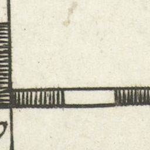
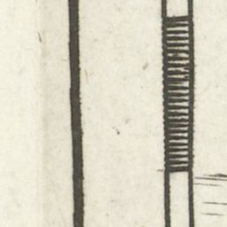

## Leaflet-rastercoords plugin

Leaflet-rastercoords plugin is a Leaflet plugin for plain image map projection to display large images using tiles generated with gdal2tiles-leaflet.  Have a look at https://github.com/commenthol/leaflet-rastercoords

Have a look at `index.html` open it in your text editor and your browser.

	var rc = new L.RasterCoords(map, [mapwidth,mapheight])

The `RasterCoords` converts the image height and with in pixels to map units. So every map unit equals 1 px. We added a click event so you can discover for yourself. Click at the top most level of the map. This is point `[0,0]`. Now click at the bottom right, this is point `[ 4060, 5500]`. The with and height of our image in pixels! 

By using this coordinate system to project our coordinates we can make them readable for our pop-up!

	var coords = rc.project(event.latlng)

The marker however still has to be placed in the lat lon coordinates, so we need to unproject the marker location before adding it to the map:
		
		var marker = L.marker(rc.unproject(coords)).addTo(map)

## To the map scale! 

In order to show the right numbers, the same ones as on the image, we have to measure how many pixels is one map unit! In our case at zoom level 5, 1 px is 1 map unit. 

Have a look at the `.xml` file that came with your tiles. You can find this in your folder of your tiles. 
We need the following information:

- Height and with of image in px
- The zoom level where 1 px = 1 unit

#### the x scale

Look at one tile 5/1/20

One stripe is 84px. (measure with Photoshop or GIMP!)
One stipe is 0.25 on our image axis. 

So after some math:

|zoom 5 | 84 px | 84 map units | CRS.Simple |
|zoom 5 | 84 px | 0.25 map units | Meso image | 
|zoom 5 | 1 px  | 0.0027654879 map units | Meso image|

More Math:

		Our conversion factor is 0.0027654879.
		The scale = 1/factor = 336
		mapwith/tilewidth = factor
		tile width = 256 px
		map width = 0.7619
		offset = (map width * scale) / 2
		offset = 127.9992 

#### the y scale

Now do the same for the y-axis.

|zoom 5 | 163 px | 163 map units | CRS.Simple |
|zoom 5 | 163 px | 0.25 map units | Meso image | 
|zoom 5 | 1 px  | 0.001533742 map units | Meso image|

		Our conversion factor is 0.001533742.
		The scale = 1/factor = 652
		mapwith/tilewidth = factor
		tile width = 256 px
		map width = 0.0.392637
		offset = (map width * scale) / 2
		offset = 127.999972352 

Let's use this in our example! 

#### Making a custom CRS

		var factorx = 0.002765487
		var factory = 0.001533742
		var offsetx = 127.9992
		var offsety = 127.999972352

		//Create custom coordinate system
		L.CRS.mySimple = L.extend({}, L.CRS.Simple, {
		  projection: L.Projection.LonLat, //flat 
		  transformation: new L.Transformation(factorx, offsetx, -factory, offsety ),
		  // Changing the transformation is the key part, everything else is the same.
		  // By specifying a factor, you specify what distance in meters one pixel occupies (as it still is CRS.Simple in all other regards).
		  // In the actual project, I compute all that from the gdal2tiles tilemapresources.xml, 
		  // which gives the necessary information about tilesizes, total bounds and units-per-pixel at different levels.
 
		// Scale, zoom and distance are entirely unchanged from CRS.Simple
		  scale: function(zoom) {
		    return Math.pow(2, zoom);
		  },

		  zoom: function(scale) {
		    return Math.log(scale) / Math.LN2;
		  },

		  distance: function(latlng1, latlng2) {
		    var dx = latlng2.lng - latlng1.lng,
		      dy = latlng2.lat - latlng1.lat;

		    return Math.sqrt(dx * dx + dy * dy);
		  },
		  infinite: true
		});

